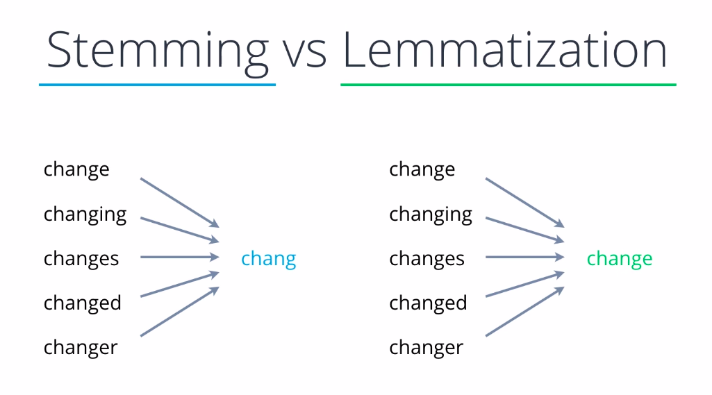

# What is NLP?

In plain english its *Natural Language Processing*, which means the process of the human-natural language.

In other words, we try to make the machine understand the logical text order and meaning, by using some techniques, like Vectorization, Deep Learning (LSTM) and other known techiniques.

In order to implement the NLP process, we will use some libraries to help us out:

 - Spacy (2015):
   - Cannot choose algorithm implementation
   - Aways the only algorithm implemented by spacy is usually the most efficient.
   - Does not include pre-created models (Sentiment Analysis)
   - Pretty fast in comparision
 - NLTK (2001):
   - Can choose the implementation of the algorithm.
   - Easier to perform Sentiment Analysis.

What do we do with text data? We try to create structures out of a high unstructured data.

## Spacy

1. Load Language
2. Build a Pipeline: Phases to be passed one by one in a "real" pipeline.
3. Use Tokens
4. Do Parts-of-Speech Tagging
5. Understand Token Attributes

We can separate process by:

 - Tokenization:
   - Separate parts of the Text into countable items.
   - Needed to apply any other kind of text analysis.
   - Prefix ($, (, ", ...)
   - Sufix (km, ), ',', '.', '!', ...) 
   - Infix ( - , --, /, ...)
   - Exception (Ponctuantion Rules)
 - Stemming:
   -  Method to categorize words from ROOT word.
   -  "Cuidarei" -> "Cuidar"
   -  Stemming is a critical and hard proccess, since that Spacy choose to use Lemmatization instead of Stemming.
   -  Porter's Algorithm:
      -  Five phases of word reduction
      -  Mapping Rules. Example SSES -> SS, IES -> I
      -  Can use Length/Complexuty of a word to apply a rule. Example: m>0 ATIONAL -> ATE
      -  Snowball -> Stemming language more accurately of Porter's Algorithm.
      
 - Lemmatization:
   - Considers full language vocabulary to apply morphological analysis to words.
   - mice -> mouse
   - Was -> Be
   - Depends yet on the Sentence use.
   - Its needed a lot of information to build a Lemmatization
 - Stop Words
   - Words that appear so frequentely that doesn't need to be tagged ("the", "a")
   - They can be filtered from tests

Vocabulary and Matching
 - Match and label specific phrases.
 - Powerfull Regex with POS in account. 